# Ontology (Information science)

In the context of computer and information sciences, an ontology defines a set of representational primitives with which to model a domain of knowledge.

(_definition_ by Tom Gruber: https://tomgruber.org/)

# Protege

A free, open-source ontology editor and framework for building intelligent systems

https://protege.stanford.edu/

# Ontology (Information science)

In the context of computer and information sciences, an ontology defines a set of representational primitives with which to model a domain of knowledge.

(_definition_ by Tom Gruber: https://tomgruber.org/)

# Ontology chosen by me 

The field of knowledge I chose, for which I decided to create a model representing a certain part of reality are __desktop applications__.

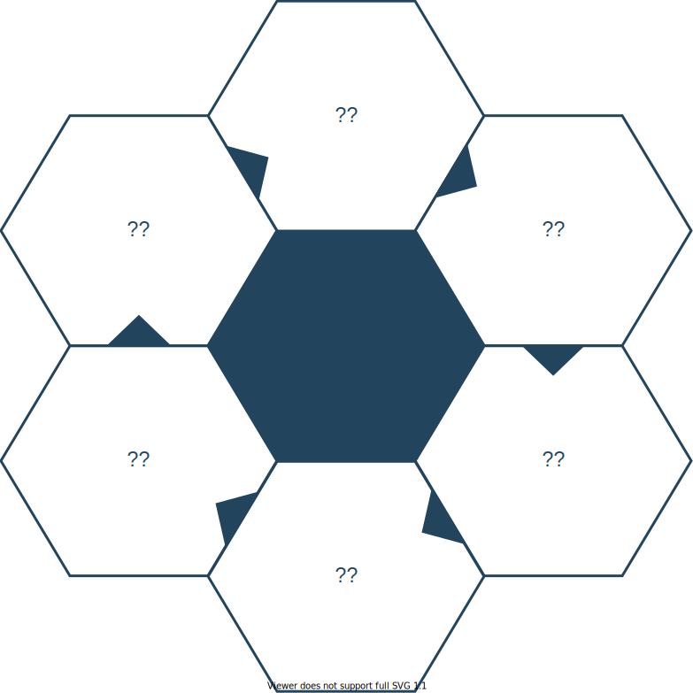

# Desktop applications

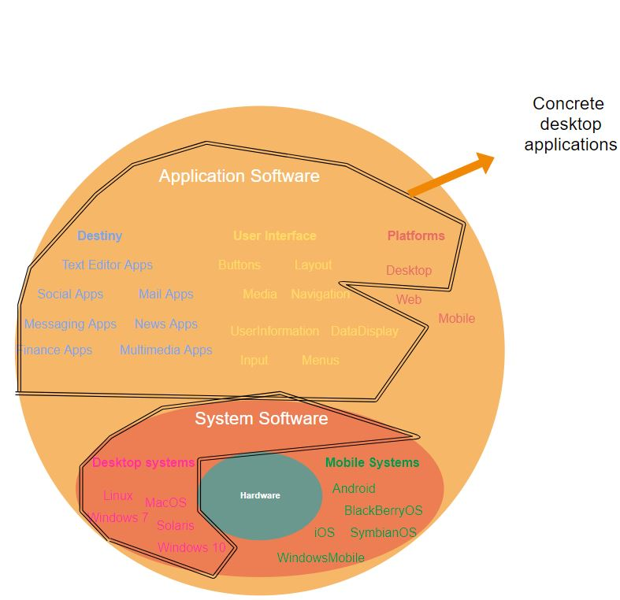

## Platforms

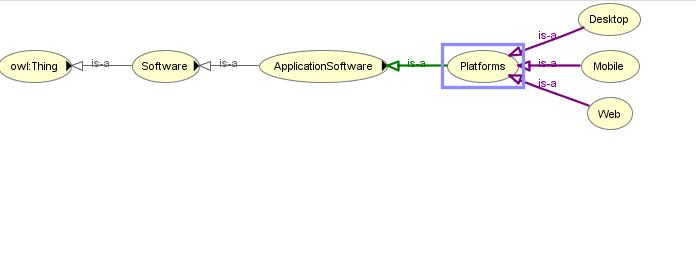

## SystemSoftware

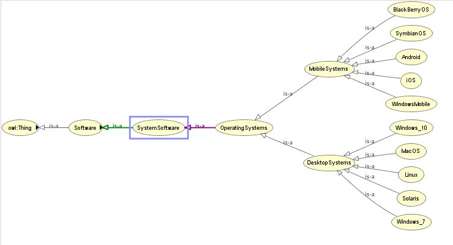

## ApplicationTypes

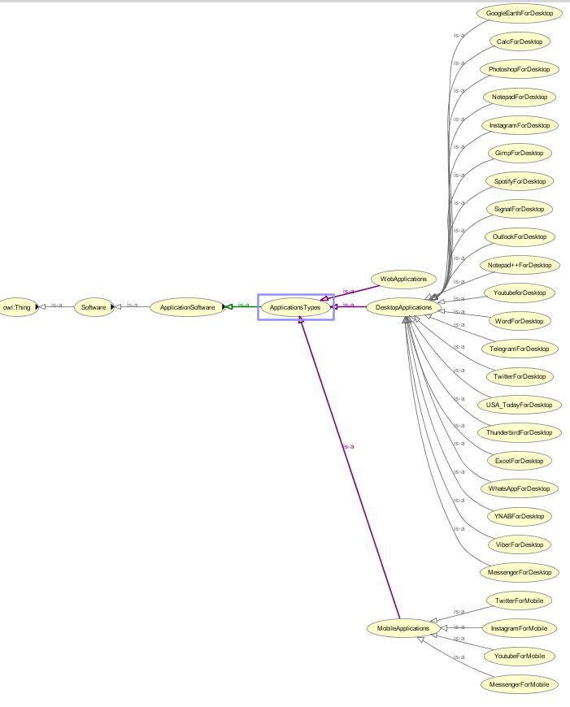

## UI

## Data properties

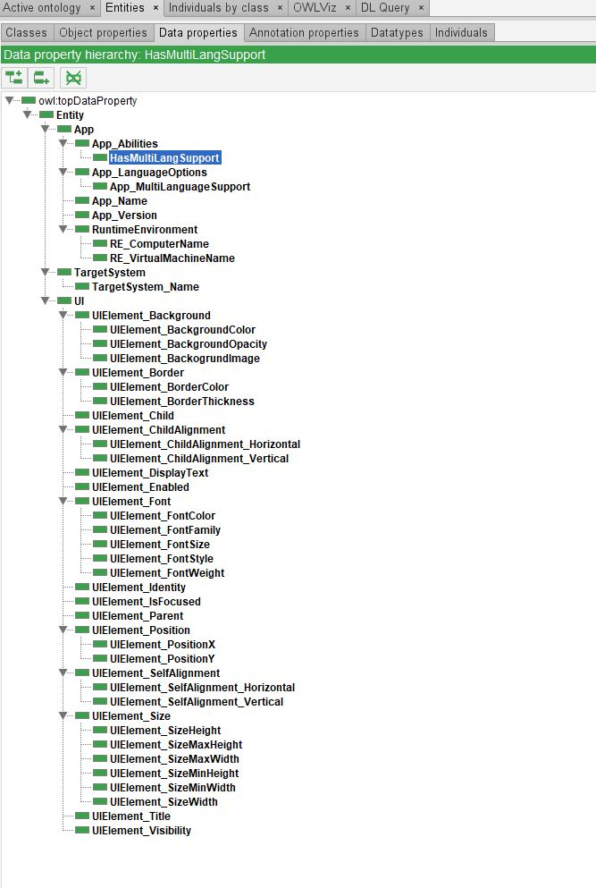

## Object properties

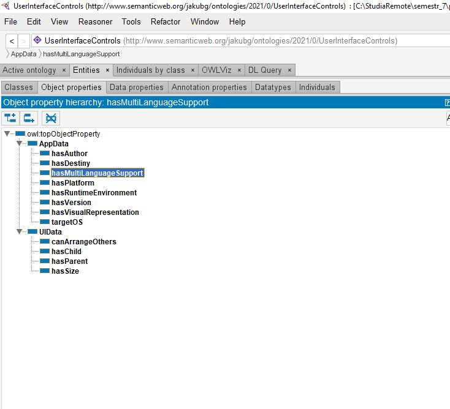

## Individuals

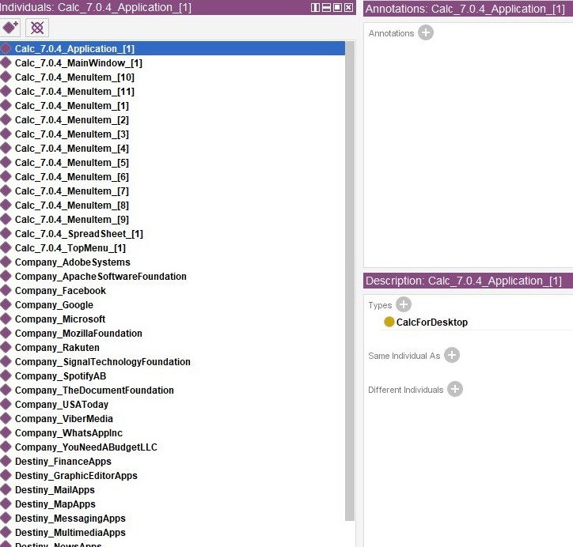

## Individuals - property assertions

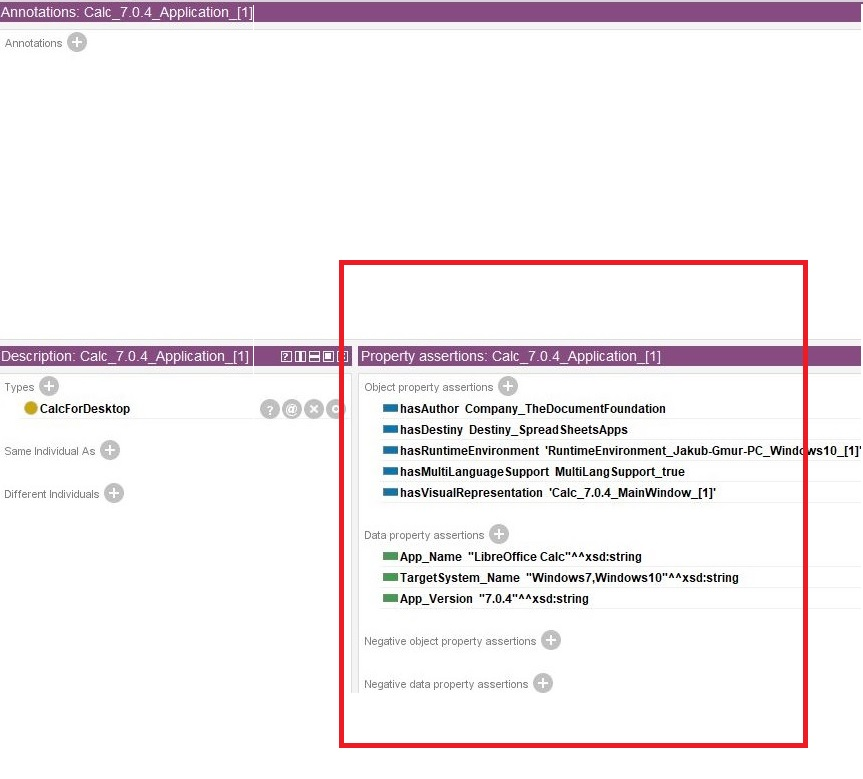

## Individuals - types and data

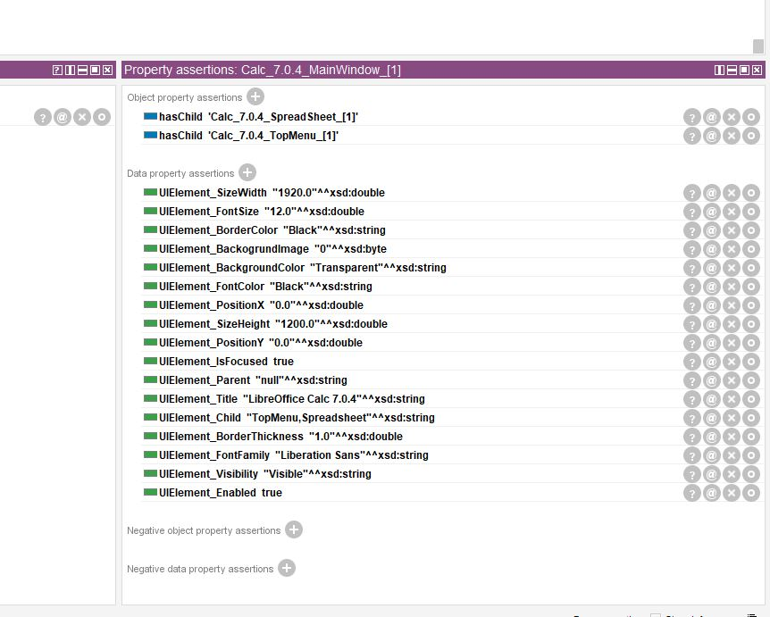

## DLQuery - DesktopApplications

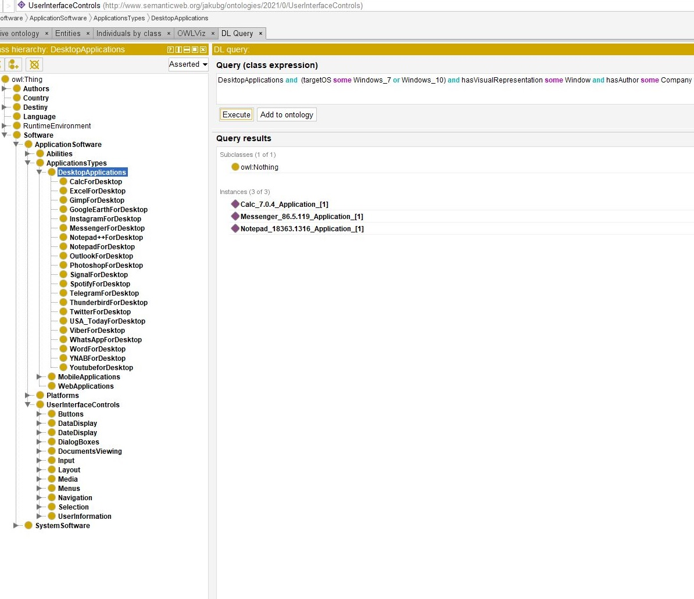