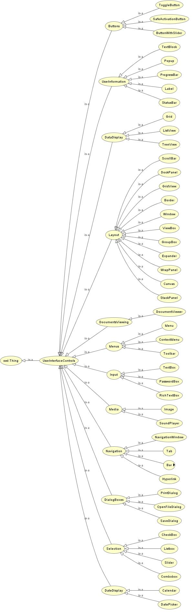

# Ontology (information science)

In the context of computer and information sciences, an ontology defines a set of representational primitives with which to model a domain of knowledge.

(_definition_ by Tom Gruber: https://tomgruber.org/)

# Protege

A free, open-source ontology editor and framework for building intelligent systems

https://protege.stanford.edu/

# Project: Ontology which describes desktop applications structure 

